# Article 10 Analysis

## 1. Technical Overview
This report details the analysis of the Article 10 citizenship dossiers extracted from the official Romanian National Citizenship Authority (ANC) publications.

### Background: What is an Article 10 Dossier?
Article 10 governs the restoration of citizenship for individuals who formally held Romanian citizenship but lost it (often resulting from voluntary emigration, political circumstances, or territorial changes), along with their direct descendants up to the 2nd degree.

The dataset (`dosare_art10.csv`) contains the raw registration dates, scheduled term dates, and final solution order dates for **42,309 individual applications**.

## 2. Methodology
The data was collected by extracting exactly four fields from the unstructured PDFs:
- `NR. DOSAR`: The unique registration identifier.
- `DATA ÎNREGISTRĂRII`: The date the dossier was registered.
- `TERMEN`: The future scheduled date for review (if unresolved).
- `SOLUȚIE`: The date the final order was issued (if resolved).

> **Data Precision Notice:** Due to a change in ANC publication format, solution dates for dossiers resolved from 2017 onward are recorded at year-level precision only (`YYYY`). To preserve statistical variance and avoid artificial clustering, these were imputed using a **probabilistic model** based on the empirical day/month distribution of known exact dates from the 2010–2016 cohorts. All duration statistics for post-2016 cohorts carry an inherent uncertainty window, but correctly reflect historical operational patterns.

## 3. Dataset Summary

The Article 10 dataset contains **42,309 individual dossiers** with registration dates spanning from **04.01.2010 to 19.01.2026** — over 16 years of operational data.

| Metric | Value |
|---|---|
| Total dossiers | 42,309 |
| Registration period | 04.01.2010 – 19.01.2026 |
| Resolved | 21,366 (50.5%) |
| Pending (scheduled) | 20,940 (49.5%) |
| No status | 3 (0.0%) |

The near-equal split between resolved and pending dossiers signals that roughly half of all Article 10 applications submitted in the observed period are still awaiting a final decision.

### 3.1 Potential Applicant Diaspora Groups
While the ANC does not publicly release applicant country-of-origin data, historical migration patterns and the [Saturation Report](saturation_report.md) identify several primary diaspora groups eligible for Article 10:
- **Turk-Tatar Diaspora**: Descendants of those who emigrated to Turkey (primarily 1923–1960).
- **Post-WWII Waves**: Significant Jewish and Ethnic German (Saxon/Swabian) emigrations.
- **Communist-Era Emigrants**: Political and economic exiles who left between 1945 and 1989.

These groups constitute the vast majority of the potential Article 10 applicant pool, estimated at 3.0M – 4.4M descendants globally.

## 4. Registration Volume Over Time

### 4.1 Monthly Registration Volume

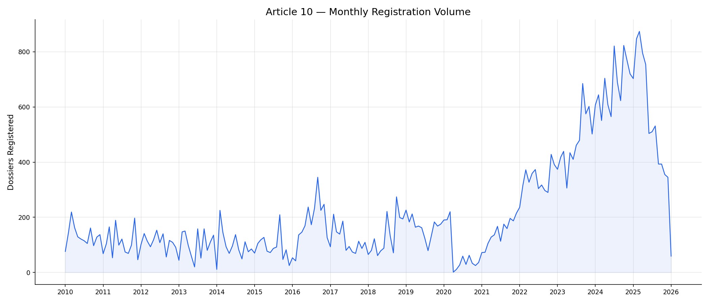

The monthly time-series shows a relatively low and stable baseline of a few hundred registrations per month from 2010 through 2020, followed by a sharp structural increase beginning in 2021. Activity collapsed to near-zero in April 2020 (1 registration) during the COVID-19 lockdown, then recovered and accelerated well beyond pre-pandemic levels. By 2024–2025, individual months routinely exceeded 700–800 registrations — volumes that the entire year of 2020 (884 total) barely matched.

### 4.2 Yearly Registration Volume

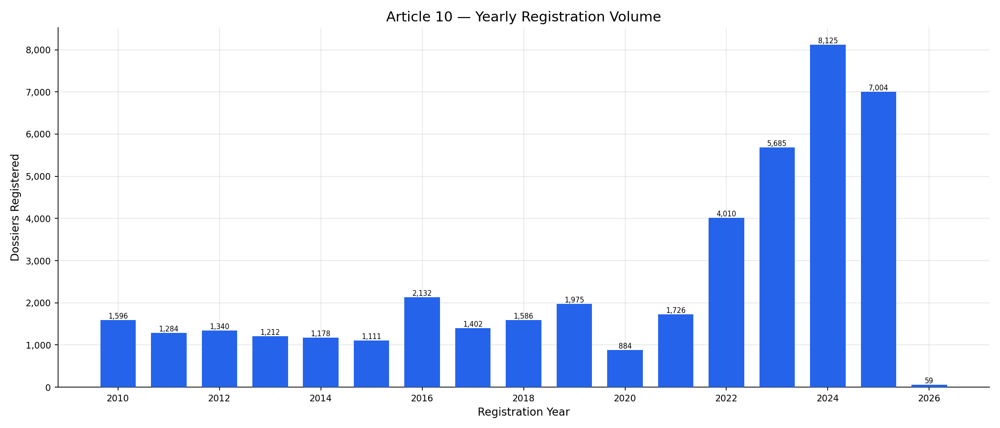

Annual intake was relatively flat between 2010 and 2019, hovering between 1,100 and 2,100 registrations per year. 2020 marked the lowest full year on record at 884 dossiers. From 2021 onward, volume escalated sharply: 1,726 → 4,010 → 5,685 → 8,125, with 2024 representing the all-time peak. The 2025 figure (7,004) is on a projected pace to match or exceed 2024. This trajectory represents a **4.6× increase** compared to the 2010–2019 baseline.

## 5. Dossier Status Breakdown

### 5.1 Overall Status Distribution

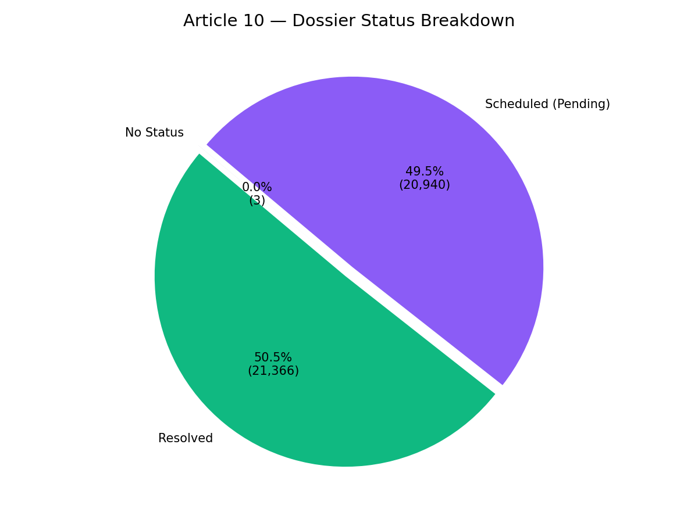

Of the 42,309 dossiers, 21,366 (50.5%) have received a final decision, while 20,940 (49.5%) remain pending with a future scheduled review date. Only 3 records fall outside both categories. The split illustrates a system that is processing applications, but at a pace unable to clear the incoming volume.

### 5.2 Resolution Rate by Registration Year

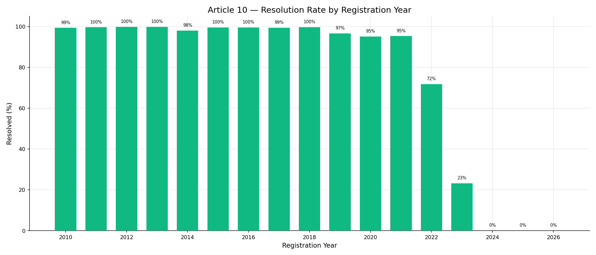

The chart shows a clear two-phase pattern. Cohorts from 2010–2021 maintain resolution rates above 95%, with 2012–2018 cohorts near-universally resolved (99.3–99.8%). The 2022 cohort shows a significant shift (71.8%), which decreases to 23.3% in 2023. 2024–2025 cohorts show no resolutions. This reflects the impact of elevated intake on processing speed.

## 6. Processing Duration Analysis

> **Reminder:** Solution dates for dossiers resolved from 2017 onward were imputed using a probabilistic model (see Section 2).

### 6.1 Wait Time Distribution

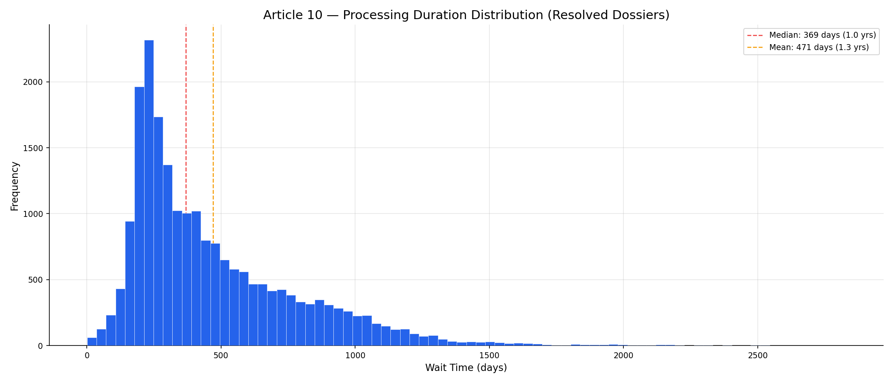

Among the 21,366 resolved dossiers, the distribution of processing time (days from registration to final order) shows:

| Statistic | Value |
|---|---|
| Median | 369 days (1.0 year) |
| Mean | 471 days (1.3 years) |
| Minimum | 6 days |
| Maximum | 2,827 days (7.7 years) |
| Std. Deviation | 318 days |

The positive skew (mean > median) indicates that while the typical case resolves in about a year, a long tail of cases drags on for several years, pushing the average upward.

### 6.2 Median Processing Time by Registration Year

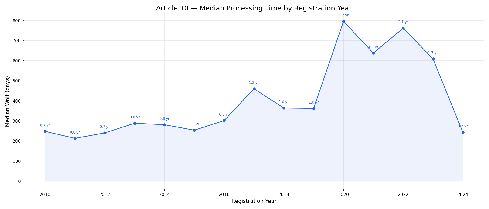

The chart shows three distinct phases. From **2010–2016**, median wait was stable at **213–302 days** (~0.7–0.8 years). A step-change occurred in **2017 (460 days)**, followed by a return to ~340–364 days in 2018–2019. The COVID disruption then produced a sharp spike: **2020 cohort median reached 796 days (2.2 years)**, the highest on record. Post-COVID cohorts (2021–2022) remained elevated at 638–762 days. The apparent decline in 2023–2024 (609 and 243 days) is misleading — these cohorts have very low resolution rates (23% and 0%), so the medians reflect only the fastest-resolved cases, not the full cohort experience.

---

# Part II: Analysis

## 7. Data Drivers
The sharp increase in registrations observed from 2021 onward suggests a significant activation of the potential applicant pool. However, without country-of-origin data, these surges are treated as **structural intake growth** rather than being attributed to specific external geopolitical or economic events.

## 8. Throughput vs. Cumulative Backlog

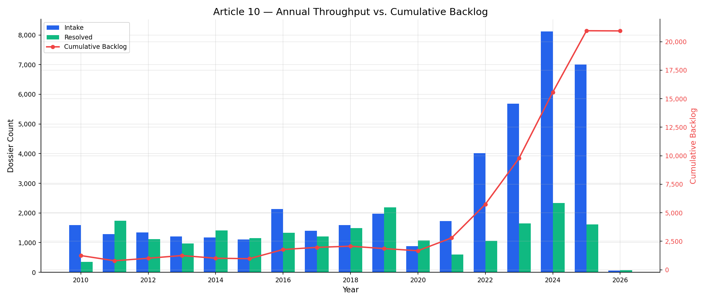

The throughput data indicates the following workload changes:

| Year | Intake | Resolved | Net | Cumulative Backlog |
|------|--------|----------|-----|-------------------|
| 2010–2015 | ~1,100–1,600/yr | ~1,000–1,700/yr | Near-balanced | ~1,000 |
| 2016 | 2,132 | 1,329 | +803 | 1,776 |
| 2021 | 1,726 | 599 | +1,127 | 2,798 |
| 2022 | 4,010 | 1,057 | +2,953 | 5,751 |
| 2023 | 5,685 | 1,649 | +4,036 | 9,787 |
| 2024 | 8,125 | 2,340 | +5,785 | 15,572 |
| 2025 | 7,004 | 1,618 | +5,386 | 20,958 |

From 2021 onward, intake has consistently exceeded output. The cumulative backlog grew from 1,858 (2019) to 20,958 (2025). At current resolution rates, clearing this volume would require approximately 13 years.

The 11.3× backlog increase was driven by the *simultaneous* collapse of output (post-COVID) and the sharp escalation of intake from ~2,000/yr to peak volumes of over 8,000/yr — a structural mismatch that remains the institution's primary challenge.

## 9. Seasonality

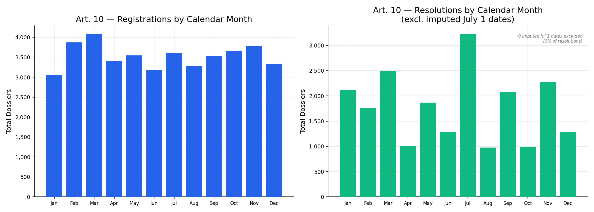

Registration volumes show moderate seasonal variation, with higher activity in spring (March–May) and autumn (September–November). The resolution panel reflects the actual monthly processing rhythm of ANC, reinforced by probabilistic imputation for year-only resolution data to avoid artificial clustering.

## 10. Cross-Article Diagnostics

> Cross-article findings — including Ukraine war impact, COVID recovery asymmetry, per-capita productivity collapse (709→239), leadership performance, deadline compliance, and Law 14/2025 impact — are detailed in the [Cross-Article Analysis Report](cross_article_analysis_report.md), §1–6.

---

# Part III: Projections

## 11. Constraints & Methodology
All projections are based on historical trends and assume current institutional conditions persist. They do not account for future legislative changes or administrative reforms.

## 11. Intake Demand Forecast (Monthly 2021–2028)

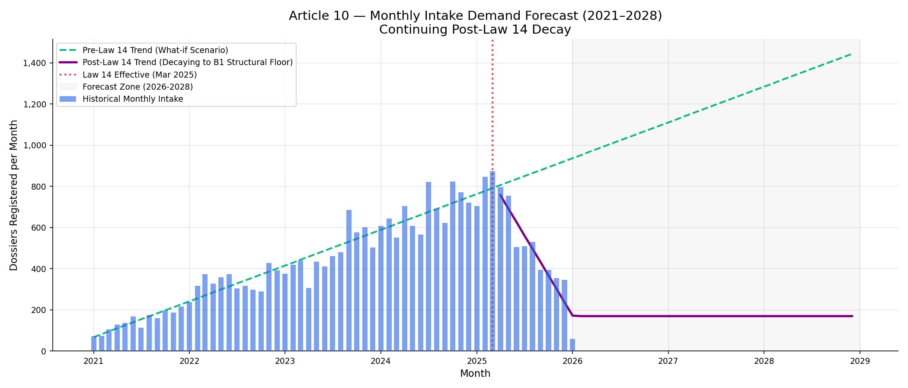

Before Law 14/2025 went into effect in March 2025, Article 10 registrations were on a steady upward trajectory. A linear projection of the 2021–2025 data suggested demand would continue to rise.

However, Law 14/2025 introduced a severe structural break. The chart now plots the actual monthly intake, isolating the post-April 2025 period to model the new reality. 

Fitting a trend line to the post-Law 14 months reveals a steep, continuing decay in new registrations. However, demand will not fall to zero as genuine applicants adapt and obtain B1 certificates. We project the decay will stabilize at a new **"B1 Structural Floor"**—conservatively estimated at 25% of the 2024 peak levels. The projected annualized average over the next three years (2026–2028) stabilized at this floor is roughly **2,032 dossiers per year**. This represents a massive reduction from historical growth trends, but remains a significant baseline demand.

## 12. Backlog Projection

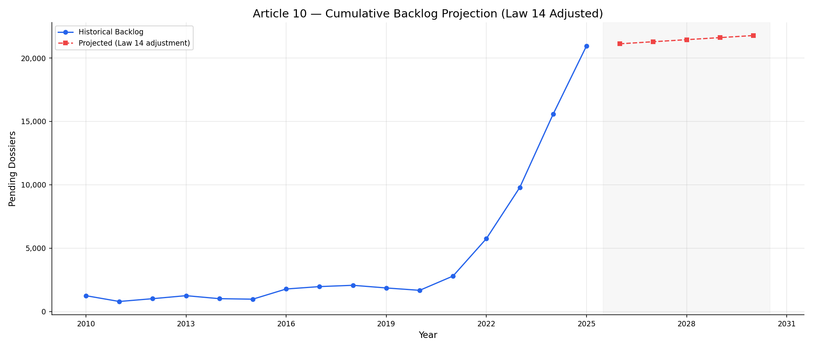

Now that Law 14 is in effect, forecasting the monthly decay trend suggests intake will stabilize at a B1 Structural Floor of roughly **2,032/yr** over the next 3 years. Because current output averages only 1,869/yr, the system still runs a small annual deficit. 

Under these Law 14-adjusted conditions, the backlog is projected to grow slowly from 20,958 (2025) to **21,773 by 2030**. Although Law 14 has drastically slowed the rate of accumulation for Article 10, it has not stopped the bleeding. Organic clearance is impossible at the current resolution rate.

**Queue position estimate:** A dossier filed currently would reach the resolution stage in approximately 11.2 years, assuming FIFO processing.

## 13. Survival Analysis — Corrected Wait Times

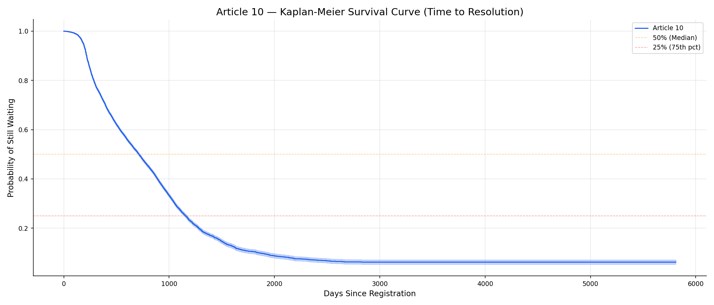

The Kaplan-Meier survival analysis treats pending dossiers as right-censored observations, correcting for the systematic downward bias in naive median calculations:

| Metric | Naive (resolved only) | KM Corrected (all dossiers) |
|--------|----------------------|----------------------------|
| Median wait | 369 days (1.0 yr) | **714 days (2.0 yr)** |
| Bias | — | **+345 days** |

Standard reporting typically averages only finalized dossiers, which can introduce skewed results. **Survival Analysis** (Kaplan-Meier) incorporates both pending and resolved dossiers to provide a more accurate estimate of total system time. This analysis indicates the actual duration is significantly higher than basic averages.

## 14. Cross-Article Scenarios & Reform

> Cross-article predictive scenarios (backlog trajectories, staffing requirements, productivity recovery, wait-time tipping points, cost of inaction) and prescriptive analysis (reform roadmap, Law 14 clearance window, stress tests, KPI dashboard) are detailed in the [Cross-Article Analysis Report](cross_article_analysis_report.md), §7–16.
