# Article 11 Analysis

## 1. Technical Overview
This report details the structural analysis of the Article 11 citizenship dossiers, representing the overwhelming majority of the Romanian National Citizenship Authority (ANC) workload. 

### Background: What is an Article 11 Dossier?
Article 11 governs the restoration of citizenship for individuals whose ancestors lost their status due to historical territorial annexations (primarily descendants from "Greater Romania" territories like modern-day Moldova and certain Ukrainian regions).

The sheer volume of these applications dictates the overall health and operational reality of the entire ANC institution.

The dataset (`dosare_art11.csv`) contains the raw registration dates, scheduled review dates, and final solution order dates for **733,922 individual applications** spanning over a decade.

## 2. Methodology
Using the official publications from the ANC website, data was extracted via a Python pipeline matching regular expressions for dossier numbers and sequence dates. As with the Article 10 dataset, dates containing only a year were imputed to a mid-year point (01.07.YYYY) to allow for chronological calculations.

> **Data Precision Notice:** Due to a change in ANC publication format, solution dates for dossiers resolved from 2015 onward are recorded at year-level precision only (`YYYY`). To preserve statistical variance and avoid artificial clustering, these were imputed using a **probabilistic model** based on the empirical day/month distribution of known exact dates from the 2012–2014 cohorts. All duration statistics for post-2014 cohorts carry an inherent uncertainty window, but correctly reflect historical operational patterns.

## 3. Dataset Summary

The Article 11 dataset contains **733,922 individual dossiers** with registration dates spanning from **01.01.2012 to 23.03.2026** — over 14 years of operational data, representing the overwhelming majority of the ANC's caseload.

| Metric | Value |
|---|---|
| Total dossiers | 733,922 |
| Registration period | 01.01.2012 – 23.03.2026 |
| Resolved | 582,573 (79.4%) |
| Pending (scheduled) | 150,885 (20.6%) |
| No status | 464 (0.1%) |

Unlike Article 10's near-even split, Article 11 shows a 79.4% resolution rate, reflecting a longer operational history and a different processing trajectory. However, the 150,885 pending dossiers still represent a substantial backlog in absolute terms.

### 3.1 Potential Applicant Diaspora Groups
The Article 11 track primarily serves descendants of individuals born in territories that were part of Greater Romania between 1918 and 1940. Based on historical data and the [Saturation Report](saturation_report.md), the primary groups include:
- **Territorial Residents**: Citizens of modern-day Moldova and specific regions of Ukraine (Northern Bukovina, Hertsa).
- **Secondary Migrants**: Descendants of those who moved from these territories to other regions prior to citizenship loss.

The total potential pool for Article 11 is estimated at 6.0M – 8.0M descendants globally, representing the institution's largest long-term workload source.

## 4. Registration Volume Over Time

### 4.1 Monthly Registration Volume

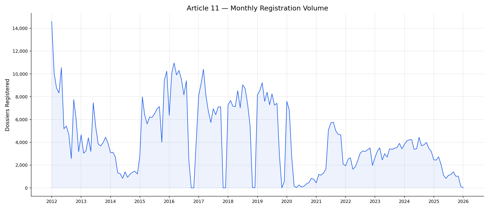

The monthly time-series shows initial peaks—January 2012 recorded 14,578 registrations—followed by a stabilization around 6,000–7,000 per month from 2015 through 2019. Following the 2020 operational reduction, registrations have remained lower and more variable, between 1,500 and 5,000 per month.

### 4.2 Yearly Registration Volume

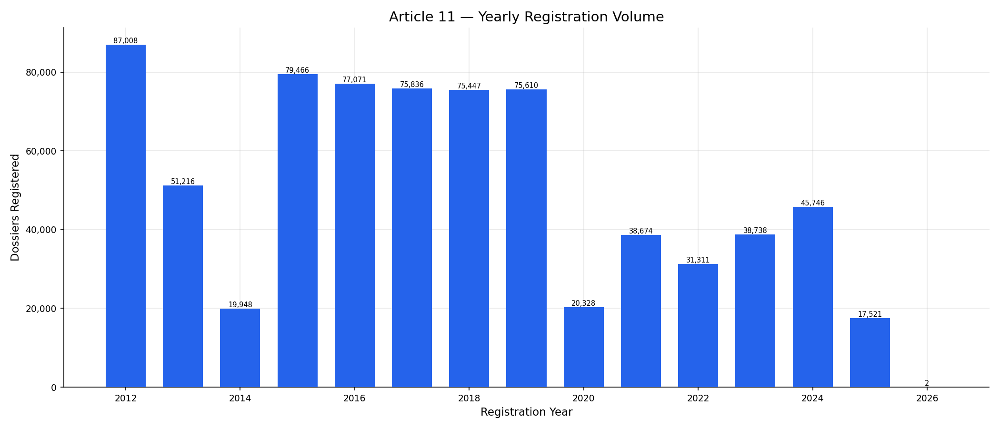

2012 was the highest year on record (87,008 registrations), followed by a lower volume in 2014 before stabilizing at ~75,000–80,000 per year from 2015 through 2019. The 2020 decrease (20,328) was followed by a partial recovery, but annual volumes have remained below the pre-2020 average: 38,674 (2021), 31,311 (2022), 38,738 (2023), and 45,746 (2024). Current throughput remains below 2015–2019 capacity.

## 5. Dossier Status Breakdown

### 5.1 Overall Status Distribution

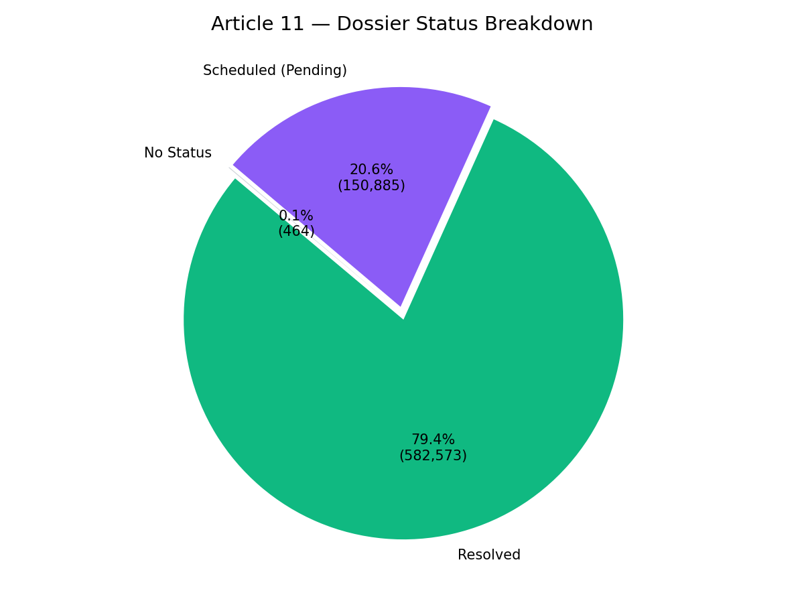

Of the 733,922 dossiers, 582,573 (79.4%) have received a final decision, while 150,885 (20.6%) remain pending with a scheduled review date. The 464 records with no status represent extraction edge cases and are statistically negligible.

### 5.2 Resolution Rate by Registration Year

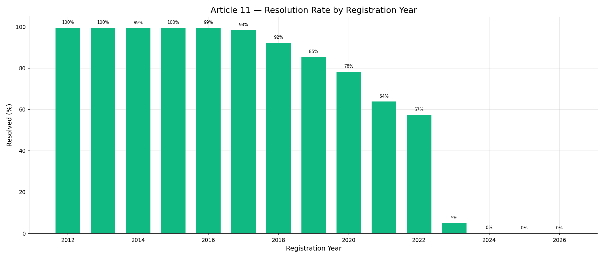

The data indicates a gradual increase in the time needed for resolution. Cohorts from 2012–2017 are largely resolved (over 98%). The change begins in 2018 (92.3%) and continues: 2019 at 85.4%, 2020 at 78.3%, 2021 at 63.8%, 2022 at 57.3%. For 2023, 4.8% are resolved, and 2024–2025 show near-zero resolution. This pattern reflects the accumulation of backlog over time.

## 6. Processing Duration Analysis

> **Reminder:** Solution dates for dossiers resolved from 2015 onward were imputed using a probabilistic model (see Section 2).

### 6.1 Wait Time Distribution

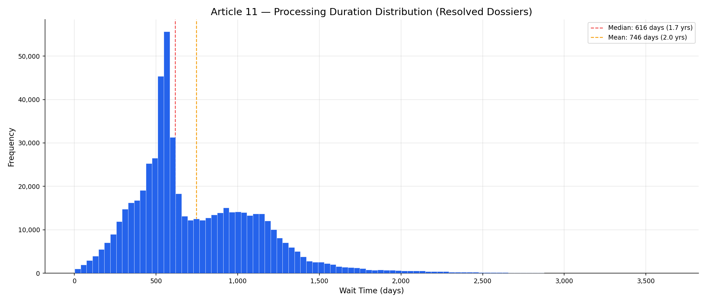

Among the 582,573 resolved dossiers, the distribution of processing time (days from registration to final order) shows:

| Statistic | Value |
|---|---|
| Median | 616 days (1.7 years) |
| Mean | 746 days (2.0 years) |
| Minimum | 3 days |
| Maximum | 3,640 days (10.0 years) |
| Std. Deviation | 392 days |

Article 11 processing times are notably longer than Article 10's (median 1.7 years vs. 1.0 year). The distribution exhibits substantial positive skew, with a long tail reaching nearly a decade. The wider standard deviation (392 days) also indicates greater unpredictability for applicants.

### 6.2 Median Processing Time by Registration Year

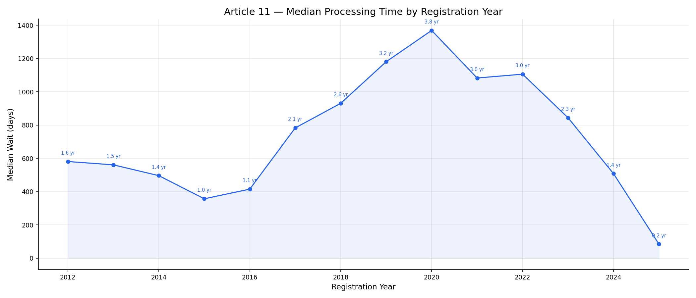

The data shows an increasing wait time. After an initial reduction from 581 days (2012) to 356 days (2015), the median increased to 783 days in 2017, 931 in 2018, 1,181 in 2019, and 1,369 days (3.7 years) for the 2020 cohort. Post-2020 medians remain around 1,100 days (2021–2022). Medians for 2023–2024 reflect only the small percentage of resolved cases and likely underestimate the final experience for these cohorts.

---

# Part II: Analysis

## 7. Data Drivers
Article 11 registration volume shifted from the high-volume levels of 2015–2019 to a lower rate post-2020. The primary constraint appears to be institutional throughput and verification requirements rather than a lack of demand.

## 7.1 Registration Intervals (2016–2019)
A detailed monthly analysis shows a structural recurring phenomenon in Article 11: specific periods where registration volume was nearly zero.

Between 2016 and the 2020 lockdown, Article 11 registrations exhibited four identical "blackout" cycles where monthly volume dropped to near-zero in November/December before a massive rebound in January:

| Cycle | Transition | The Blackout (Min Volume) | The Rebound (Jan) |
|-------|------------|---------------------------|-------------------|
| **2016/17** | Sept→Oct | **Oct–Dec: < 1 dossier/mo** | Jan 2017: 8,121 |
| **2017/18** | Oct→Nov | **Nov–Dec: 2 dossiers/mo** | Jan 2018: 7,281 |
| **2018/19** | Oct→Nov | **Nov–Dec: 17 dossiers/mo** | Jan 2019: 8,149 |
| **2019/20** | Sept→Oct | **Nov 2019: 4 dossiers/mo** | Jan 2020: 7,596 |

**Administrative Detail:** Comparison with Article 10 for the same period shows that this behavior did not affect the restoration track, suggesting specific administrative constraints for Article 11 registration at the central office. Current monthly volumes remain at approximately half of the pre-2020 baseline, indicating that Article 11 remains limited by processing capacity.

## 8. Throughput vs. Cumulative Backlog

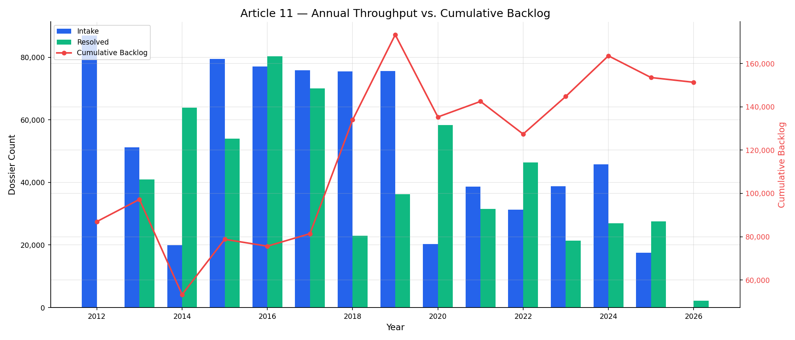

The throughput chart reveals Art. 11's structural backlog dynamics:

| Year | Intake | Resolved | Net | Cumulative Backlog |
|------|--------|----------|-----|-------------------|
| 2012 | 87,008 | 30 | +86,978 | 86,978 |
| 2014 | 19,948 | 63,918 | −43,970 | 53,261 |
| 2016 | 77,071 | 80,258 | −3,187 | 75,611 |
| 2018 | 75,447 | 22,897 | +52,550 | 133,948 |
| 2019 | 75,610 | 36,232 | +39,378 | 173,326 |
| 2020 | 20,328 | 58,331 | −38,003 | 135,323 |
| 2024 | 45,746 | 26,979 | +18,767 | 163,582 |

The backlog peaked at 173,326 in 2019. A significant shift occurred in 2018 when output decreased to 22,897 despite stable intake, leading to an increase in the backlog that has persisted since.

## 9. Seasonality

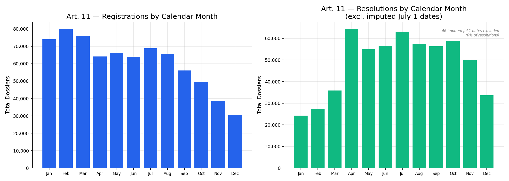

Art. 11 registrations show a pronounced January spike (driven by the 87K first-year volume in 2012), with otherwise even distribution across calendar months. The resolution panel reflects the internal monthly processing rhythm of the ANC, using probabilistic imputation for year-only resolution data to preserve natural variance.

## 10. Cross-Article Diagnostics

> Cross-article findings — including Ukraine war impact, COVID recovery asymmetry, per-capita productivity collapse (709→239), leadership performance, deadline compliance, and Law 14/2025 impact — are detailed in the [Cross-Article Analysis Report](cross_article_analysis_report.md), §1–6.

---

# Part III: Projections

## 11. Constraints & Methodology
All projections are based on historical trends and assume current institutional conditions remain unchanged. They do not account for potential legislative changes or administrative reforms.

## 11. Intake Demand Forecast (Monthly 2021–2028)

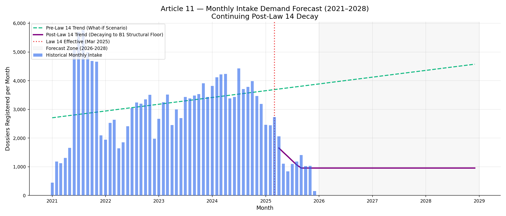

Before Law 14/2025 went into effect in March 2025, Article 11 registrations were gradually recovering from their COVID-era lows. A linear projection of the 2021–2025 data suggested a slow climb back toward the pre-COVID plateau, though structural bottlenecks meant it would take years to reach historical highs.

However, Law 14/2025 introduced a severe structural break. The chart now plots the actual monthly intake, isolating the post-April 2025 period to model the new reality. 

Fitting a trend line to the post-Law 14 months reveals a steep, rapid decay in new registrations. Because Article 11 applicants heavily depend on processing archival documents from neighboring countries before even registering, the new B1 language certification requirement acts as an immediate structural hard gate. However, demand will not fall to zero. We project the decay will stabilize at a new **"B1 Structural Floor"**—conservatively estimated at 25% of the 2024 peak levels as genuine applicants adapt to the requirement. The projected annualized average over the next three years (2026–2028) stabilized at this floor is roughly **11,436 dossiers per year**. This represents a massive 70%+ structural reduction from 2024 levels, resetting Article 11 demand to a sustainable baseline.

## 12. Backlog Projection

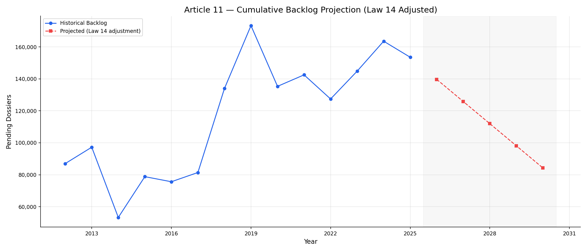

This represents a **massive structural pivot** for Article 11. 

Under the status quo, the backlog was projected to grow indefinitely. However, forecasting the deeply reduced post-Law 14 intake shows demand stabilizing at the B1 Structural Floor (projected avg 11,436/yr). Thus, intake has fallen significantly *below* the system's current output capacity (25,295/yr). 

The system now runs an annual *surplus* of roughly 13,850 processing slots.

Under these new Law 14-adjusted conditions, the Article 11 backlog is projected to shrink from 153,539 (2025) to **84,248 by 2030**. Law 14 is actively and naturally clearing the Article 11 queue without any capacity expansion — achieving full clearance organically in approximately **11 years**.

**Queue position estimate:** A dossier currently filed would reach the resolution stage in approximately 6.1 years at current resolution rates, assuming FIFO processing.

## 13. Survival Analysis — Corrected Wait Times

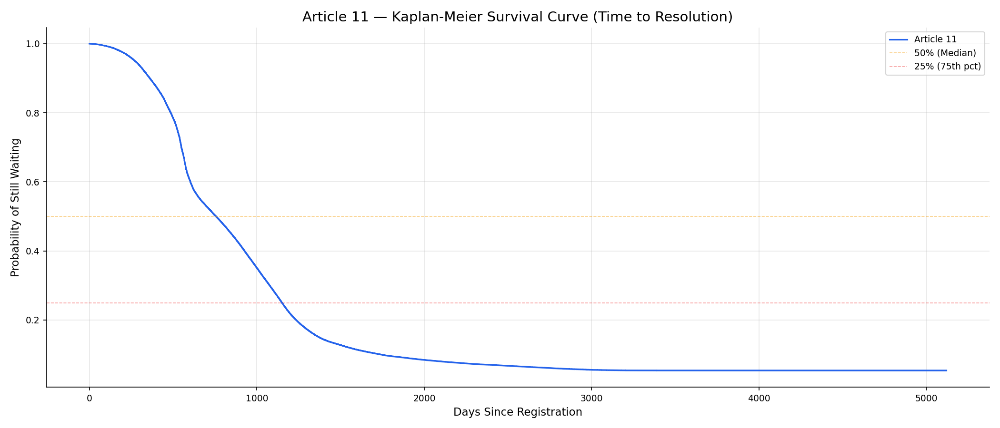

| Metric | Naive (resolved only) | KM Corrected (all dossiers) |
|--------|----------------------|----------------------------|
| Median wait | 616 days (1.7 yr) | **757 days (2.1 yr)** |
| Bias | — | **+141 days** |

Standard wait-time metrics often only account for dossiers that have already been finalized (resolved). This approach introduces a statistical bias because it excludes the most recent applicants and those who have been waiting the longest without a resolution.

**Survival Analysis** (Kaplan-Meier correction) provides a more accurate performance metric by incorporating the status of every dossier in the system, including those still pending in the queue. For Article 11, while the correction is lower than Article 10 due to a higher resolution rate, it still reveals that the typical applicant waits over **2 years**—a reality that is obscured by looking only at finalized cases.

## 14. Cross-Article Scenarios & Reform

> Cross-article predictive scenarios (backlog trajectories, staffing requirements, productivity recovery, wait-time tipping points, cost of inaction) and prescriptive analysis (reform roadmap, Law 14 clearance window, stress tests, KPI dashboard) are detailed in the [Cross-Article Analysis Report](cross_article_analysis_report.md), §7–16.
