# Cross-Article Analysis

> **Scope:** This report synthesizes findings across Article 10 and Article 11 dossier data. It covers institutional-level diagnostics, predictive scenario modeling, and prescriptive reform recommendations that cannot be attributed to either article in isolation.
>
> **Companion reports:** [Article 10 Report](article_10_analysis_report.md) · [Article 11 Report](article_11_analysis_report.md)

---

# Part II: Analysis

## 1. Potential Applicant Pool Overview

Based on the statistical synthesis in the [Saturation Report](saturation_report.md), the "Global Addressable Market" (GAM) of Romanian descendants eligible for citizenship is significantly larger than current registration volumes. 

### Article 10 (Restoration)
Estimated Pool: **3.0M – 4.4M descendants**. 
Primary groups include the Turk-Tatar diaspora (Turkey), post-WWII Jewish and Ethnic German (Saxon/Swabian) waves, and Communist-era emigrants. Current saturation is estimated at ~1.1%.

### Article 11 (Re-acquisition)
Estimated Pool: **6.0M – 8.0M descendants**.
Primarily residents and descendants of the lost territories of Bessarabia, Northern Bukovina, and Hertsa. Current saturation is estimated at ~10.5%.

The current volume relative to potential applicant pools suggests that institutional capacity and registration processes are primary factors in current workload levels.

Indexing both articles to their 2019 baseline (=100%) reveals the recovery asymmetry: Art. 10 reached **411%** of its 2019 level by 2024, while Art. 11 recovered to only **61%**. Art. 10's growth is driven by a structural intake normalization following the 2020 collapse. Art. 11's stagnation points to institutional throughput failure — the system that produced 75,000+ registrations per year from 2015–2019 appears permanently degraded by COVID disruption, OUG 82/2021 verification requirements, and staffing losses.

## 3. Per-Capita Productivity

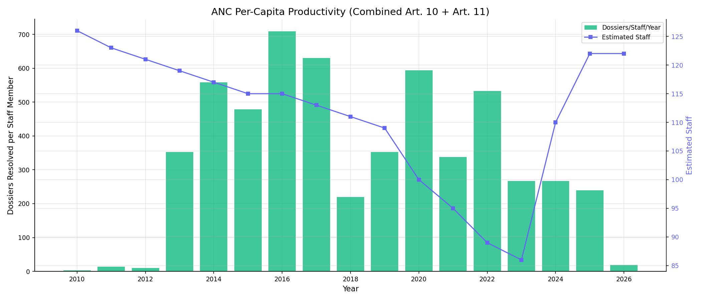

Per-capita productivity (total resolutions per estimated staff member per year) decreased from 709 in 2016 to 239 in 2025. While staffing levels have increased recently, productivity has not returned to earlier levels, suggesting that the bottleneck is related to internal processes or verification requirements.

## 4. Leadership Performance

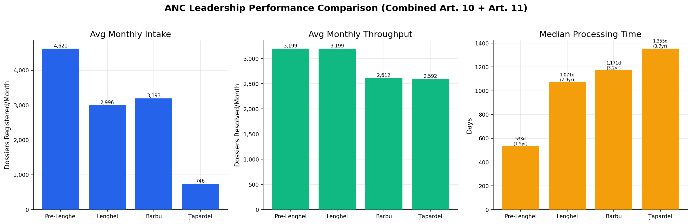

Comparing leadership eras across three metrics — monthly intake, monthly throughput (resolutions occurring during the period), and median processing time of dossiers resolved during the period:

| Period | Avg Monthly Intake | Avg Monthly Output | Median Wait |
|--------|-------------------|-------------------|-------------|
| Pre-Lenghel (–May 2020) | 4,621/mo | 3,199/mo | 533 days |
| Lenghel (May 2020–May 2024) | 2,996/mo | 3,199/mo | 1,071 days |
| Barbu (May 2024–Nov 2025) | 3,193/mo | 2,612/mo | 1,171 days |
| Țapardel (Nov 2025–present) | 746/mo | 2,592/mo | 1,355 days |

The pre-Lenghel era had the highest intake (4,621/mo) but also the shortest processing times (533 days). Under Lenghel, while monthly output actually *exceeded* intake (3,199 vs. 2,996), the median wait doubled to 1,071 days — meaning ANC was resolving older dossiers, not keeping pace with the queue. The trend continued under Barbu and Țapardel, with median wait climbing to 1,355 days (3.7 years) by the current period. Art. 11 constitutes the vast majority of these volumes. The declining intake under Țapardel reflects the data cutoff (January 2026), not a structural change.

**Wait time factors:** The increase in median wait time is largely a function of the total queue depth. As the backlog grows, each resolved dossier reflects a registration date further in the past. This indicates that current resolution rates are insufficient to reduce the total volume effectively.

## 5. Legal Deadline Compliance

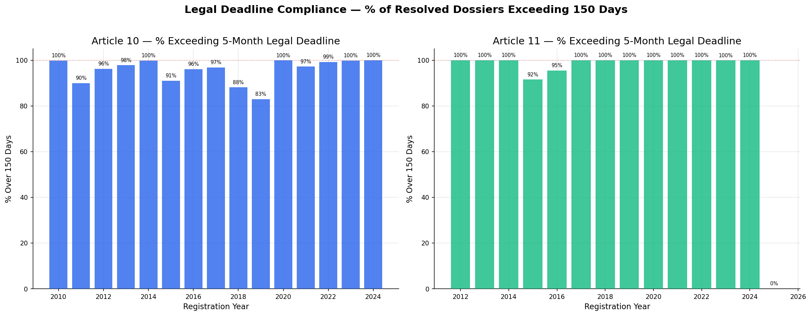

The original legal deadline for processing was 5 months (150 days). Law 14/2025 extended this to 2 years (730 days). The compliance chart shows what percentage of resolved dossiers exceeded the 150-day threshold by registration year. For both articles, non-compliance has been near-universal for all recent cohorts.

### The "Deadline Trap": Is 2 Years Sufficient?
A comparison of the new 2-year deadline with current processing times:

| Track | 2-Year Deadline | Actual Median Wait (KM) | Breach Intensity | Status |
|-------|-----------------|-------------------------|------------------|--------|
| **Article 10** | 730 days | **714 days** (1.95 yr) | -16 days | **Fragile Compliance** |
| **Article 11** | 730 days | **1,211 days** (3.32 yr) | **+481 days** | **Structural Failure** |

**Conclusion:** The 2-year deadline currently exceeds the processing capability for Article 11. For Article 10, processing times are currently close to the 2-year mark. Significant capacity increases would be required to meet this standard across both tracks.

## 6. Law 14/2025 (Language Proficiency) Impact

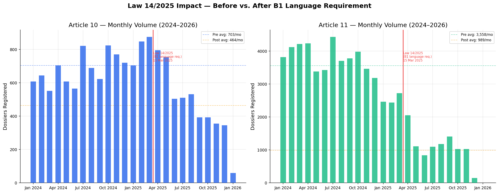

The current data (through January 2026) captures only Phase 1. The full demand impact will become visible after March 2026. For applicant pools where Romanian is not the primary language (such as the second-degree diaspora groups), the impact of the hard gate is expected to be significantly more severe, ultimately creating a new lower structural floor for intake across both tracks.

---

# Part III: Projections

## 7. Constraints & Methodology
All projections are based on historical trends and assume current conditions remain unchanged. They do not account for potential legislative changes or administrative reforms.

## 7. Backlog Scenarios (Status Quo / Reform / Demand Shock)

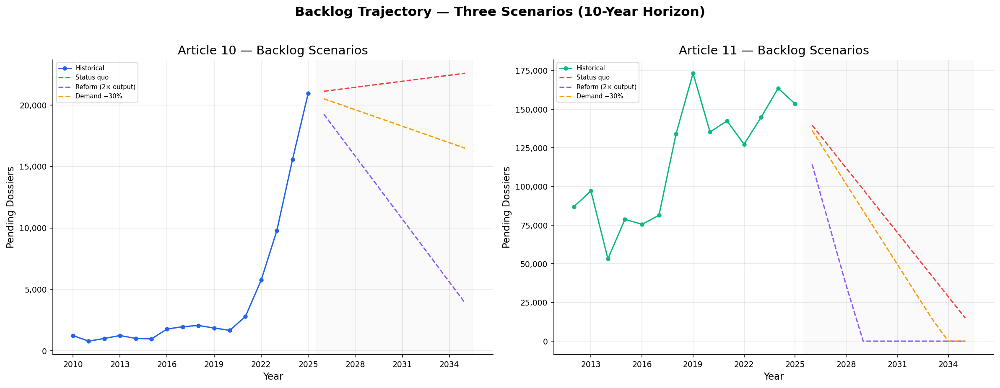

With Law 14 as the new baseline, the "Status Quo" no longer shows explosive growth. Instead, the combined system now trends toward organic clearance over a 12.7-year horizon. Under the *reform* scenario (doubled output), clearance accelerates dramatically, reaching zero backlog by late 2028. Under *demand shock* (baseline −30%), clearance occurs roughly 2 years faster than the status quo. 

## 8. Productivity Recovery Impact

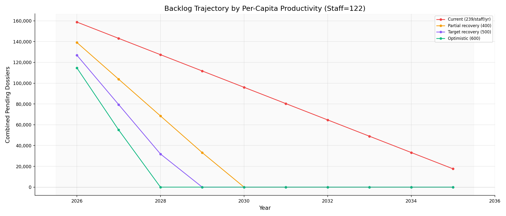

At the current headcount of **122 staff**, the system is mathematically capable of clearing the backlog without additional hiring. If productivity recovers to the 2016-era target of **500 dossiers/staff/year**, the current staff could clear the entire 174,497 queue by 2030 while keeping pace with new intake. The bottleneck is therefore structural (verification requirements/OUG 82), not a lack of headcount.

## 9. Wait-Time Tipping Point

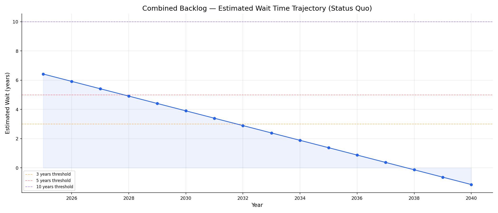

With Law 14 providing a "demand ceiling," estimated wait times for new applicants have peaked and are finally on a downward path. Currently starting at **6.4 years**, the wait is projected to fall below 3 years by **2032** and reach near-zero by **2038** under the status quo. 

## 10. Cost of Inaction

Over a 5-year horizon under the Law 14 status quo:
- Combined backlog shrinks from 174,497 to **106,021 dossiers**
- Cumulative wait burden: **667,057 person-years** of uncertainty
- Inaction "cost": Remaining in this slow organic clearance mode (12.7 years) rather than adopting Scenario D (3 years) inflicts **~430,000 additional wait-years** on the applicant pool compared to the optimized reform path. 

## 11. Minimum Viable Reform Package (5-Year Clearance)

To clear the entire backlog within 5 years while processing new intake:

| Reform Option | Requirement |
|---------------|-------------|
| **A. Hiring only** | 202 staff at current productivity (239/yr) |
| **B. Reform only** | Productivity must reach 396/staff/yr at current 122 staff |
| **C. Hybrid** | 200 staff at 242/staff/yr productivity |

---

# Part IV: Analysis of Recommendations

> **Note:** Productivity reform targets (400, 500/staff/yr) and intake-processing staff fractions (20%) are estimates. Where assumptions are made, they are stated explicitly.

## 12. Reform Roadmap — Sequenced Scenario Comparison

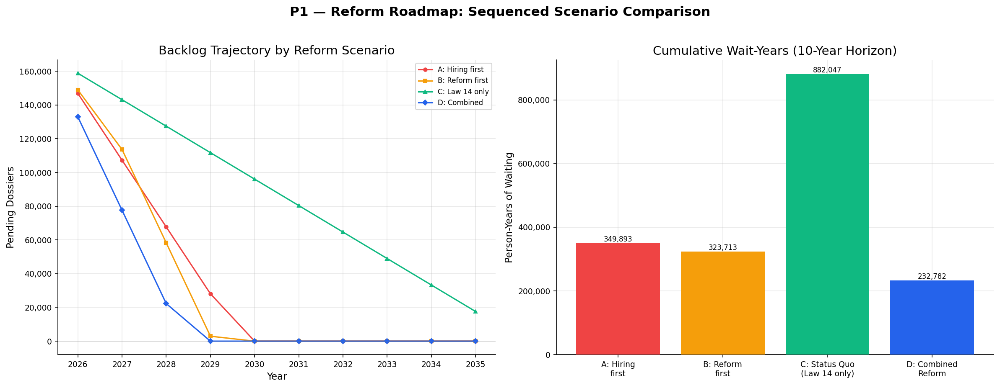

Four sequenced reform scenarios modeled over 10 years:

| Scenario | Description | 10-Year Cumulative Wait-Years |
|----------|-------------|------------------------------|
| **A. Hiring first** | +100 staff in Years 1–2, no productivity reform | 349,893 |
| **B. Reform first** | Productivity→400 by Year 2, then +50 staff Year 3 | 323,713 |
| **C. Status Quo** | Post-Law 14 baseline (intake decaying to B1 floor, no reform) | 882,047 |
| **D. Combined** | +50 staff Year 1, productivity→400 Year 2 | **232,782** |

The data indicates that while Law 14 has reduced new intake, the existing backlog of 174,000 dossiers remains a significant workload. Combined staff increases and process improvements offer the fastest path to reducing queue depth.

## 13. Law 14/2025 as a Clearance Window

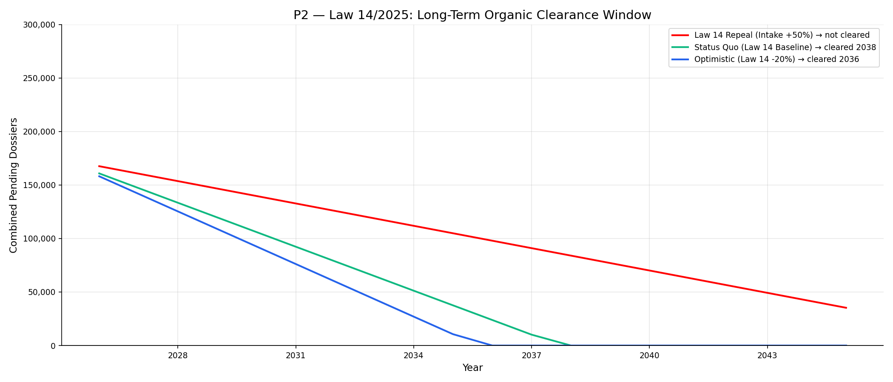

Now that Law 14 is in effect, forecasting the monthly decay trend suggests intake will rapidly decline but ultimately stabilize. We project it will reach a "B1 Structural Floor" of approximately 25% of the 2024 peak levels as genuine applicants adapt to the requirement. This equates to a combined baseline of roughly **13,500 dossiers/year**. 

With output remaining at ~27.1K/yr, the system nets a surplus of roughly 13,600 processing slots annually. At this rate, the existing 174K backlog will clear organically in roughly **12.7 years**. 

Law 14 has successfully stopped the deep bleeding. However, 12.7 years is still an unacceptably long wait time for thousands of applicants who have already waited years. Capacity expansion and reform (Scenario D) can accelerate this clearance to under 3 years.

### Capacity Redeployment

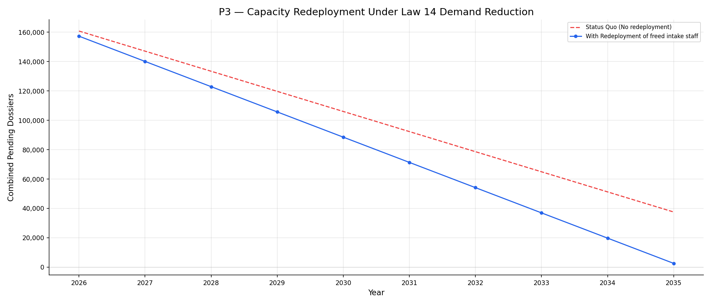

Because incoming volume has dropped by ~60% combined, the staff previously dedicated to registration and intake processing are underutilized. If 20% of ANC staff handled intake natively, a 60% intake drop allows redeploying approximately ~12% of the workforce (roughly 15 people) to backlog reduction. While this adds a small but meaningful ~3,500/yr in output capacity, it does not fundamentally change the multi-decade timeline on its own.

## 14. Risk & Contingency

### Stress Test — Demand Shock Resilience

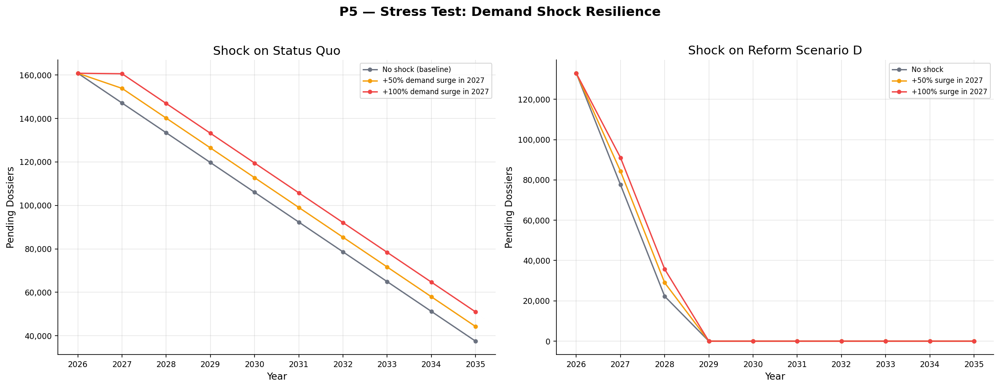

Under status quo, a +50% demand surge in 2027 would add ~20K to the backlog in a single year. A +100% surge adds ~41K. Under Scenario D (combined reform), the system absorbs even a +100% shock and continues its downward backlog trajectory — demonstrating that reform creates the resilience buffer the current system lacks.

If Law 14 is repealed and intake returns to pre-2020 levels, the backlog would be expected to increase significantly, highlighting the importance of structural processing improvements.

## 15. KPI Dashboard & Reform Timeline

### Recommended KPIs

| KPI | Baseline (2025) | 3-Year Target | 5-Year Target |
|-----|-----------------|---------------|---------------|
| Monthly throughput | 3,300/mo | 5,000/mo | 6,500/mo |
| Queue depth | 174,497 | 120,000 | 50,000 |
| New-applicant estimated wait | 6.4 years | 4.0 years | 2.0 years |
| Per-capita productivity | 239/yr | 400/yr | 500/yr |
| 2-year deadline compliance | ~0% | 30% | 60% |

### Reform Impact Timeline (Scenario D)

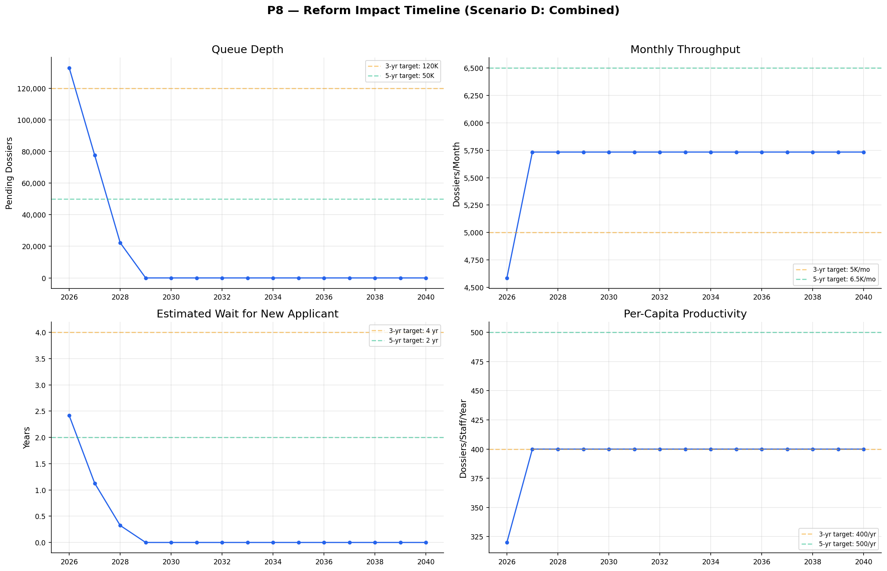

Under the combined reform scenario:

| KPI Target | Achieved By |
|------------|-------------|
| Queue depth < 120K | **2027** |
| Queue depth < 50K | **2028** |
| Throughput ≥ 5,000/mo | **2027** |
| Wait estimate < 4 years | **2026** |
| Wait estimate < 2 years | **2027** |
| Productivity ≥ 400/yr | **2027** |

The combined approach achieves all 3-year targets by 2027 (Year 2 of reform) and hits the 5-year queue depth and wait-time targets by 2028 (Year 3), significantly outperforming the timeline. The 6,500/mo throughput target and 500/yr productivity target are the only stretch goals not natively reached under the Scenario D model, indicating they require more aggressive process reform.
