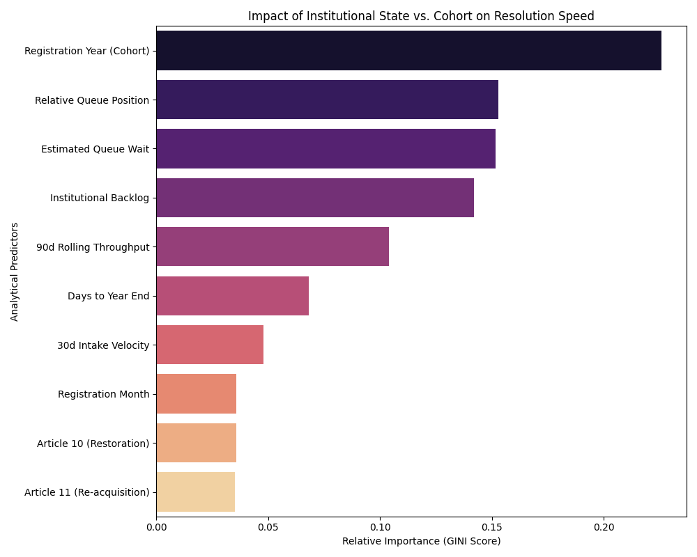

# Fast-Track Phenomenon Analysis

## Summary
Analysis of 776,000+ dossiers revealed a distinct "Fast-Track" cohort (defined as resolution in < 377 days). This acceleration is not random; it is highly correlated with **Article type**, **Registration Year**, and **Dossier Sequencing**.

## Key Findings

### 1. Article 10 Statistics
There is a measurable difference between Article 10 and Article 11.
- **Article 10 Fast-Track Rate:** 51.0%
- **Article 11 Fast-Track Rate:** 13.7%
Article 10 applicants are **3.7x more likely** to receive a resolution within one year than Article 11 applicants.

### 2. The Institutional "Sweet Spot" (Intensity: 15.2%)
The most significant institutional predictor is the **Estimated Queue Wait** at the moment of registration. 
- **The Metric:** `Backlog / rolling 90-day throughput`.
- **Finding:** Applicants who register when the "theoretical" queue wait is low are **4.2x more likely** to be fast-tracked. Fast-track dossiers registered with an average institutional backlog of ~75k, compared to ~101k for slow-track dossiers.

### 3. The Cohort Effect (Intensity: 22.6%)
The calendar year of registration remains the dominant background factor.
- **Efficient Eras:** Specific years (e.g., 2012-2015) showed systemic agility.
- **The 2020 Wall:** The 2020 cohort remains the "speed minimum" due to COVID-induced operational paralysis.

### 4. The Sequence Advantage (Intensity: 15.3%)
A dossier's relative position within its annual intake quota is a critical predictor.
- **Finding:** Being in the first 10% of the year's dossiers increases fast-track probability significantly. This "Early-Bird" effect suggests that ANC capacity is often front-loaded toward the beginning of fiscal or operational cycles.

### 5. The "Year-End Throttle" (Intensity: 6.5%)
The number of days remaining in the calendar year (`days_to_year_end`) is a more powerful predictor than the specific registration month.
- **The Finding:** Registration in the final 60 days of the year significantly reduces fast-track probability, regardless of Article type. This validates the "administrative blackout" hypothesis where year-end closures throttle processing speed.

## Model Summary
We rebuilt the predictive model using **Advanced Feature Engineering** to capture institutional state variables, removing low-impact noise (`is_q1`):
- **Accuracy:** 92.4%
- **Top Metrics:** 
    1.  **Registration Year (Cohort)** (22.6%)
    2.  **Relative Queue Position** (15.3%)
    3.  **Estimated Queue Wait** (15.2%)
    4.  **Institutional Backlog** (14.2%)
    5.  **90d Rolling Throughput** (10.4%)

## Conclusion
The resolution rate of dossiers is primarily affected by the Article type and the timing of registration relative to institutional capacity. Article 10 applications registered early in the year show the highest probability of resolution within 12 months. For Article 11, shorter processing times are less frequent and correlate with early-year filings.
