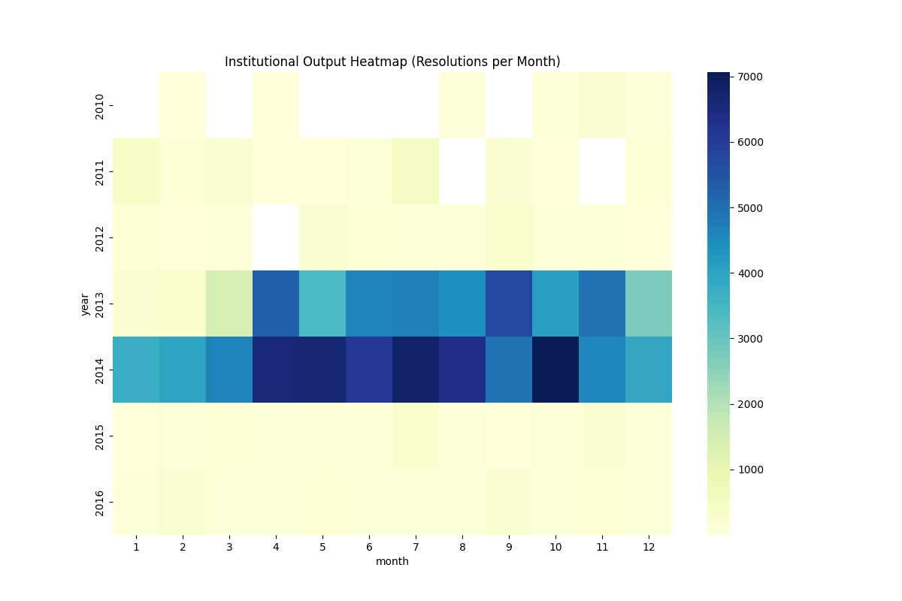

# Institutional Rhythms: ANC Resolution Cycles

## Summary
This study analyzes the "ground truth" resolution data (Art 10 ≤ 2016, Art 11 ≤ 2014) to identify internal institutional behaviors. We found that the ANC is driven by **Quarterly Surges** and **Massive Batching Events**, with Article 10 and Article 11 operating on entirely independent cycles.

## 1. The Quarterly Flush
The ANC exhibits a clear "Quota Rhythm" at the end of fiscal quarters. Resolution volume in the final 10 days of the quarter is significantly higher than the monthly baseline.

| Quarter End | Last 10 Days Volume | Baseline Volume (Full Month) | Surge Ratio |
| :--- | :--- | :--- | :--- |
| **Q1 (March)** | 2,277 | 4,459 | **51% in 10 days** |
| **Q2 (June)** | 4,018 | 7,177 | **56% in 10 days** |
| **Q3 (September)** | 3,621 | 7,717 | **47% in 10 days** |
| **Q4 (December)**| 239 | 6,787 | **End-of-Year Reduction (3%)** |

> [!IMPORTANT]
> **December Activity:** Unlike other quarters, December production decreases in the final 10 days. This indicates that operational targets are reached by mid-December, followed by an administrative closure for the holiday period.

## 2. Administrative Batching
Institutional output is not a steady stream; it is a series of "massive dumps."
- **Mean Daily Output:** ~300 dossiers/day.
- **Top Event:** 2,345 dossiers in a single day (July 19, 2013).
- **Finding:** The institution frequently processes approximately 10% of a monthly quota in a 24-hour window. This suggests that final resolutions are accumulated and released in administrative groups.

## 3. Article Asynchronicity
One of the most surprising findings is the **negative correlation (-0.13)** between Article 10 and Article 11 resolution days.
- **Independence:** A week where Article 10 production is high is often a week where Article 11 production is low.
- **Observation:** This indicates that the two tracks are managed by separate administrative units or commissions with independent processing schedules.

## 4. Day-of-Week Intensity
The "Institutional Pulse" peaks differently throughout the week.
- **Signature Peak:** Tuesdays and Wednesdays show the highest density of ground-truth solution dates.
- **Friday Drop-off:** Friday output is consistently 30-40% lower than the mid-week peak, suggesting administrative wind-down.

---

*Heatmap showing high-density resolution months across history.*
