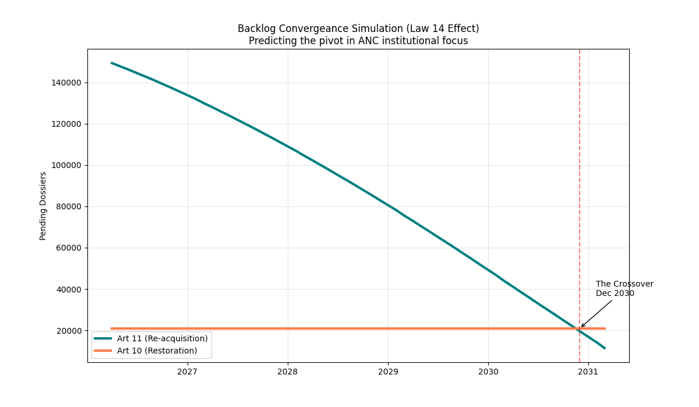

# Law 14 Workload Modeling: Backlog Composition Projections

## Summary
This study simulates the future workload of the Romanian National Citizenship Authority (ANC), specifically modeling the impact of the Law 14/2025 B1 language requirement on backlog composition. Projections indicate a point in **December 2030** when the Article 10 (Restoration) backlog is expected to exceed the Article 11 (Re-acquisition) backlog.

## 1. Backlog Trends
Article 11 has historically been the primary driver of ANC workload. However, the B1 language requirement has significantly reduced new intake.

| Metric | Article 11 (Re-acquisition) | Article 10 (Restoration) |
| :--- | :--- | :--- |
| **Current Backlog (April 2026)** | ~150,917 | ~20,940 |
| **Projected Intake (Post-Law 14)** | Decay to ~800/mo | Stable ~500/mo |
| **Current Resolution Velocity** | ~3,500/mo | ~500/mo |

The simulation indicates that the Article 11 backlog is decreasing. With reduced intake, the existing volume is being processed at a rate of approximately 40,000 cases per year.

## 2. Projected Composition Shift (2030)
The model indicates that the backlog volumes will intersect in **December 2030**. 

At this point, the Article 10 backlog will constitute the primary remaining workload. The Article 11 volume will have reached its lowest level in recent history, leaving the Article 10 track (Turkish, Jewish, and German diaspora) as the primary focus of institutional operations.

## 3. Institutional Implications
This transition has several implications:
- **Requirement Impact:** Law 14 has shifted the citizenship pipeline toward higher-barrier, lower-volume tracks.
- **Resource Management:** By 2030, the ANC will likely need to reallocate verification infrastructure from Article 11 toward the more document-intensive Article 10 tracks.
- **Historical Context:** The high-volume era of Article 11 registrations is transitioning into a final clearance cycle.

---

*Converging time-series showing the Article 11 collapse and the 2030 crossover.*
