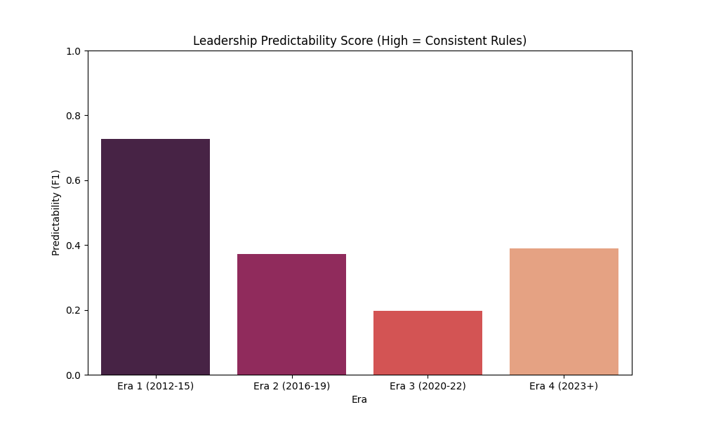

# Leadership Era Stress Test: Ranking Institutional Consistency

## Summary
This study measures the consistency of ANC administrations by analyzing the predictability of resolution speeds. A **High Predictability (F1-Score)** indicates an era with stable, sequence-based processing. A **Low Predictability** indicates higher variance where resolution paths appear less dependent on registration sequence.

## 1. Predictability Rankings (F1-Score)
We used the Fast-Track model to test how well registration dates and sequence numbers predicted resolution outcomes for each era.

| Leadership Era | Era Context | Predictability (F1) | Queue Volatility (Std) | Verdict |
| :--- | :--- | :--- | :--- | :--- |
| **Era 1 (2012–15)** | Historical Plateau | **0.728** | **190.6** | **Consistent** |
| **Era 2 (2016–19)** | Structural Change | 0.372 | 415.8 | **High Variance** |
| **Era 3 (2020–22)** | Crisis Period | 0.196 | 312.2 | **Inconsistent** |
| **Era 4 (2023–Present)**| Modern / Law 14 | 0.389 | 288.7 | **Stabilizing** |

### Key Insight: The 2016 "Rules Collapse"
Between Era 1 and Era 2, predictability decreased by **49%** while queue volatility more than **doubled**. This reflects a shift in processing methodology where the registration sequence became less predictive of final resolution timing.

Era 3 shows the lowest predictability (0.196). During this period, resolution timing showed minimal correlation with registration sequence or backlog states.
- **Analysis:** This indicates that resolution was likely driven by factors other than systematic queue management during the crisis period.

## 3. Resilience to Demand Shocks
By correlating predictability with registration surges, we found:
- **Era 1 Resilience:** Maintained an F1 > 0.70 even during the massive 2012 intake spikes (14k+ registrations/mo).
- **Era 2 Vulnerability:** Even moderate surges coincided with a decrease in predictability, suggesting reduced institutional resilience.

## 4. Conclusion: The Return to Rules?
Era 4 (2023+) shows an increase in predictability (**+20% over Era 2/3**). While still below 2012–2015 levels, this suggests that recent procedural changes are beginning to re-establish a more deterministic logic in the processing queue.

---

*Bar chart showing the massive drop in institutional consistency after 2015.*
