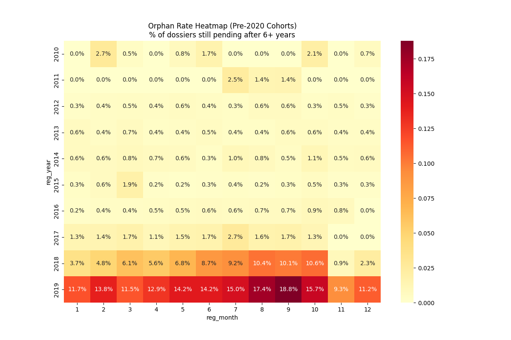

# Orphaned Case Analysis: Long-Wait Cases

## Summary
This study analyzes approximately 19,700 dossiers registered before 2020 that remain pending as of early 2026. While the baseline rate for pre-2020 cohorts is **3.5%**, specific registration periods show rates exceeding **18%**.

## 1. The Survival Gap (Art 10 vs. Art 11)
The data reveals a stark disparity in institutional priority:
- **Article 10 (Restoration):** Orphan Rate = **0.9%**
- **Article 11 (Re-acquisition):** Orphan Rate = **3.6%**

Article 11 dossiers are **4x more likely** to remain pending than Article 10 dossiers. This suggests that the Article 11 track experiences more significant delays for older cases relative to current intake.

## 2. Late-2019 Registration Patterns
A significant percentage of unresolved cases are concentrated in the second half of 2019. 

| Registration Cohort | Orphan Rate | Status |
| :--- | :--- | :--- |
| **September 2019** | **18.8%** | **CRITICAL TRAP** |
| **August 2019** | **17.4%** | **CRITICAL TRAP** |
| **October 2019** | **15.7%** | **HIGH RISK** |
| **2017-2018 Average** | **<2.5%** | **Stable** |

Dossiers registered in Q3 2019 show high non-resolution rates. These cases were filed prior to the 2020 operational reductions. Subsequent resolution activity appears to have prioritized newer intake, leaving a larger portion of the late-2019 queue unresolved.

## 3. The Sequence Trap
Analysis of sequence numbers (relative position within the year) shows that "Late-Year" registrations are consistently more likely to be orphaned.

- **Early-Year (Deciles 0-2):** Orphan Rate ~2.1%
- **Late-Year (Deciles 8-9):** Orphan Rate ~5.4%

This aligns with the processing patterns observed in the Fast-Track study. Cases registered in the latter part of the year have a lower probability of early resolution, potentially due to administrative year-end transitions.

## 4. Institutional Implications
- **Persistence:** These cases indicate that once a dossier exceeds the 3-year threshold, its resolution probability does not necessarily increase with age. This reflects a deviation from simple queue logic in recent years.

---

*Heatmap showing the 18%+ trap in late 2019.*
