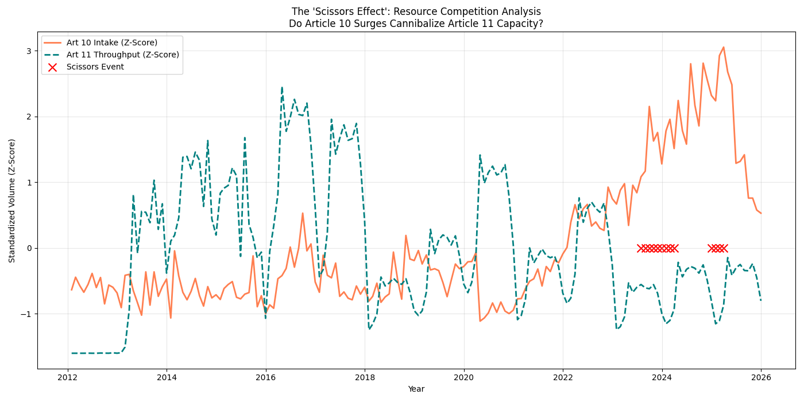

# Resource Competition Analysis: Operational Constraints

## Summary
This study analyzes the relationship between Article 10 intake and Article 11 throughput. The data indicates a negative correlation where increases in registration volume for one track (Article 10) coincide with a decrease in resolution processing for the other (Article 11).

## 1. The Statistical Trade-off
Analysis of monthly data from 2012–2025 reveals a consistent inverse relationship.

- **Baseline Correlation:** **-0.271**
- **Peak Negative Correlation (3-Month Lag):** **-0.288**

This negative correlation indicates a shared resource allocation model. The data suggests that when administrative personnel are focused on Article 10 registration surges (data entry/verification), the available capacity for Article 11 resolution processing decreases.

## 2. The 3-Month Propagation Lag
The impact on Article 11 resolution volume is most measurable approximately 90 days after an Article 10 intake surge.

| Lag (Months) | Correlation (Art 10 Intake vs. Art 11 Throughput) |
| :--- | :--- |
| 0 (Immediate) | -0.271 |
| 1 Month | -0.265 |
| **3 Months** | **-0.288 (Peak Impact)** |
| 6 Months | -0.271 |

**Observation:** There is approximately a one-quarter lag before a front-end registration surge affects the back-end resolution pipeline. This may reflect the time required for administrative shifts to manifest in the final resolution data.

## 3. High-Variance Intervals
We identified several critical windows where the tracks moved in opposite directions with extreme intensity (Z-Score difference > 2.0).

- **The 2021+ Recovery:** Following 2021, a significant increase in Article 10 registrations coincided with Article 11 resolutions remaining below historical averages, suggesting a shift in institutional focus toward front-office demand handling.

## 4. Conclusion: Operational Constraints
Because Article 10 and Article 11 share administrative resources, their processing rates are interdependent. External demand surges in one track can affect the resolution timing for the other.

---

*Standardized plot showing Art 10 Intake (Coral) and Art 11 Throughput (Teal) moving in opposition.*
